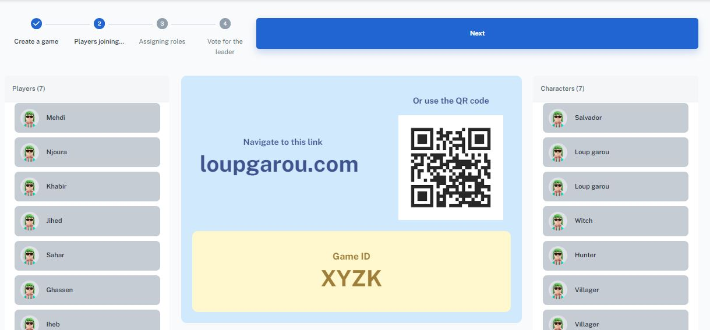
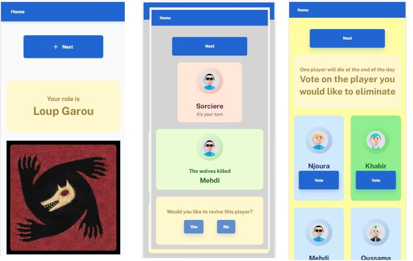

# Werewolf Role Distributor

# [Click here](https://loupgarou.netlify.app) to try the Demo

Welcome to the Werewolf Role Distributor! This web application simplifies the setup and role distribution process for the popular social deduction game, Werewolf. Whether you're playing in-person or virtually, our app ensures a smooth start to your game by assigning roles efficiently and privately.

## v1.0.0: Roles Distributor

## Key Features
- **Create New Games**: Easily set up a new game by specifying the number of players and selecting the roles you want to include.
- **Join Existing Games**: Players can join a game using a unique session code, making it easy to get everyone involved.
- **Role Assignment**: Each player receives a private notification of their assigned role.
- **User-Friendly Interface**: Our clean and intuitive UI guides you through the setup and role distribution process effortlessly.
- **Responsive Design**: Enjoy the app on both desktop and mobile devices, making it versatile for any gaming scenario.
-  [Check the backend repository](https://github.com/BenAyedMehdi/LoupGarouAPI) 

## Future Plans
- Implement the full narrator feature to automate the game phases.
- Add more customizable roles and game settings.
- Enhance the UI for a more immersive experience.
- Introduce user accounts and game history.

## About the game:
Loup Garou is a social game that takes place over a series of game rounds. Each round has two phases - day and night. During the day the village discusses who they think is guilty, during the night players may use special powers and the werewolves make their kill. One narrator is needed to moderate the game. 

## About the Project:
This website is replacing the narrator of the game. The solution is assigning roles to players, tell them what to do, record thir votes and decisions, and ensure the game rules are being respected. A server of the game is created, players can join with their phones. The concept is a bit similar to Kahoot or JackBox. The server-side development is ongoing.

## Contributers

-  [Mehdi Ben Ayed](https://github.com/BenAyedMehdi) 
-  [Hatem Khabir](https://github.com/HatemKhabir) 

